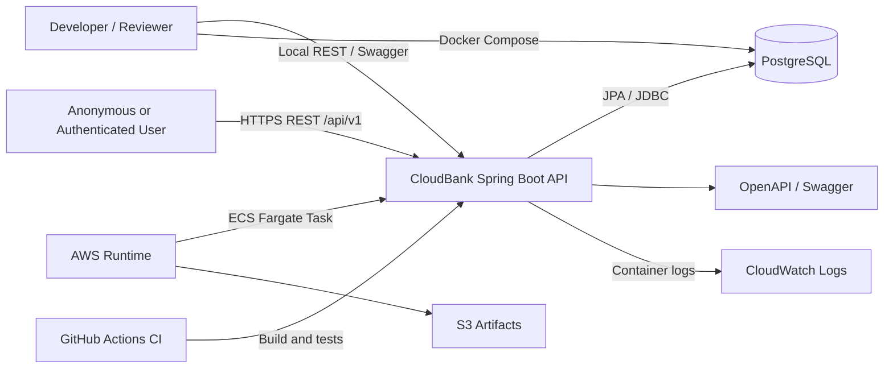
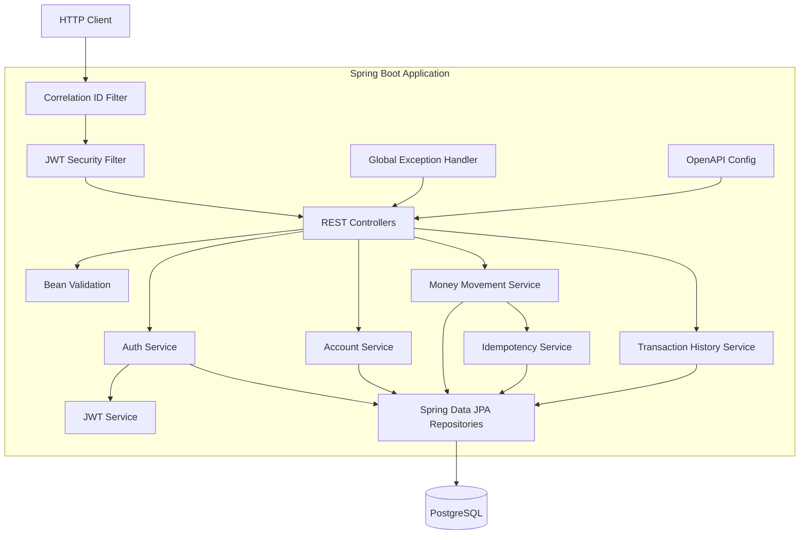
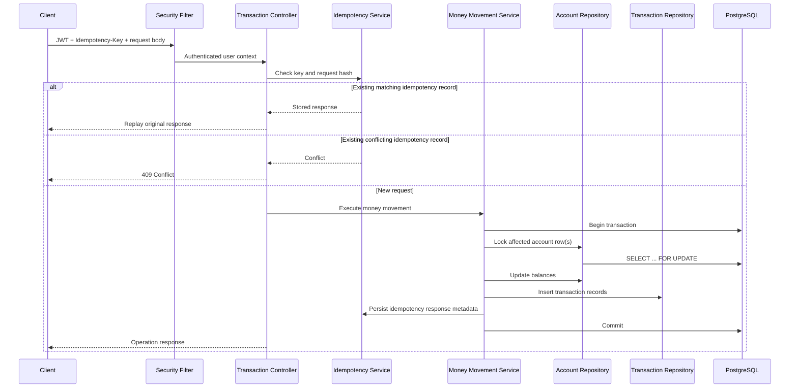
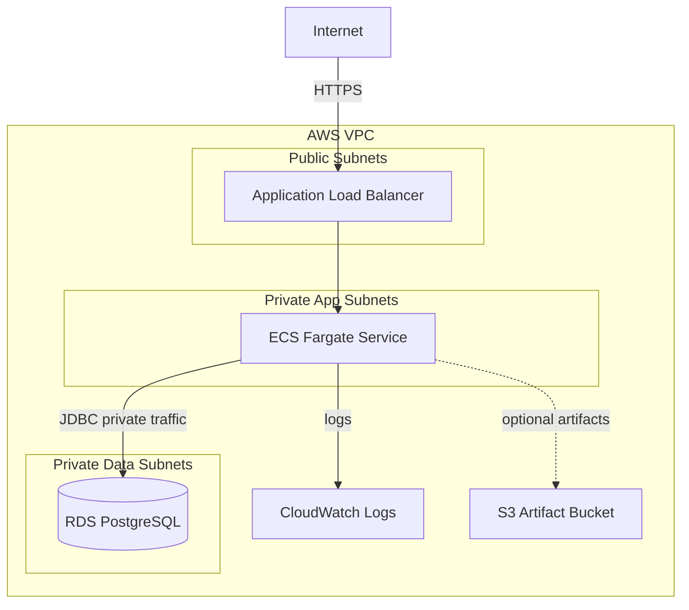
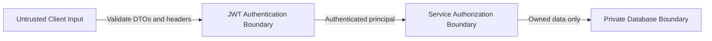

# CloudBank Architecture Diagrams

Source inputs: technical architecture package.

## 1. System Context

## 2. Application Components

## 3. Money Movement Flow

## 4. AWS Deployment Topology

## 5. Trust Boundaries

