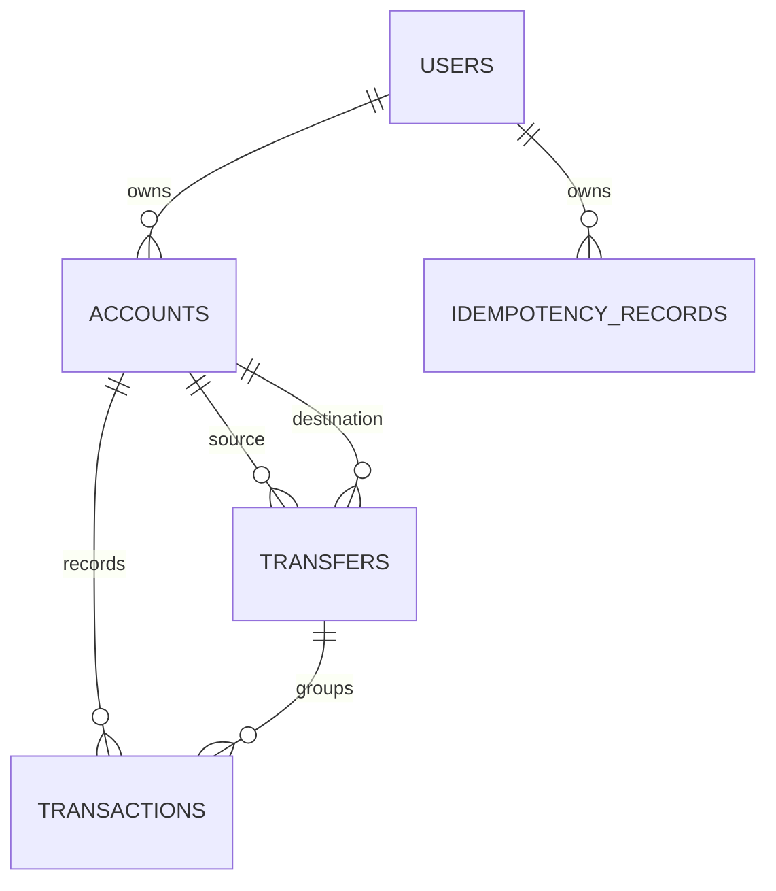

# CloudBank Data Model

Storage: PostgreSQL.

ORM: Spring Data JPA / Hibernate.

Primary data owner: CloudBank API.

## 1. Entity Relationship Overview

## 2. Users

Table: `users`

| Column | Type | Constraints | Notes |
| --- | --- | --- | --- |
| `id` | UUID | Primary key | Generated by application or DB. |
| `email` | varchar | Unique, not null | Case-normalized for lookup. |
| `password_hash` | varchar | Not null | Never returned by API. |
| `first_name` | varchar | Not null | Validated by DTO. |
| `last_name` | varchar | Not null | Validated by DTO. |
| `created_at` | timestamptz | Not null | Server-managed. |
| `updated_at` | timestamptz | Not null | Server-managed. |

Indexes:

- `ux_users_email` unique on `email`.

## 3. Accounts

Table: `accounts`

| Column | Type | Constraints | Notes |
| --- | --- | --- | --- |
| `id` | UUID | Primary key | Public account resource ID. |
| `user_id` | UUID | FK users, not null | Account owner. |
| `account_number` | varchar | Unique, not null | Human-readable generated number. |
| `balance` | numeric(19,2) | Not null | Use `BigDecimal`; never floating point. |
| `currency` | char(3) | Not null | MVP default `USD`. |
| `status` | varchar | Not null | `ACTIVE`, future `CLOSED`, `FROZEN`. |
| `version` | bigint | Optional | Needed only if optimistic locking chosen. |
| `created_at` | timestamptz | Not null | Server-managed. |
| `updated_at` | timestamptz | Not null | Server-managed. |

Indexes:

- `ux_accounts_account_number` unique on `account_number`.
- `ix_accounts_user_id` on `user_id`.

Money movement access pattern:

- Load affected account rows with `SELECT ... FOR UPDATE` inside a transaction.
- For transfers, lock account rows in deterministic order by account ID to reduce deadlock risk.

## 4. Transactions

Table: `transactions`

| Column | Type | Constraints | Notes |
| --- | --- | --- | --- |
| `id` | UUID | Primary key | Transaction resource ID. |
| `account_id` | UUID | FK accounts, not null | Account whose history includes this row. |
| `type` | varchar | Not null | `DEPOSIT`, `WITHDRAWAL`, `TRANSFER_DEBIT`, `TRANSFER_CREDIT`. |
| `amount` | numeric(19,2) | Not null | Stored as positive amount. |
| `currency` | char(3) | Not null | MVP `USD`. |
| `balance_after` | numeric(19,2) | Not null | Account balance after this transaction. |
| `related_account_id` | UUID | Nullable | Other account for transfer rows. |
| `transfer_id` | UUID | Nullable | Groups debit and credit transfer records. |
| `description` | varchar | Nullable | Bounded length. |
| `created_at` | timestamptz | Not null | Sort key. |

Indexes:

- `ix_transactions_account_created_at` on `account_id`, `created_at desc`.
- `ix_transactions_transfer_id` on `transfer_id`.

Lifecycle:

- No deletion in MVP.
- Transaction records are audit history.

## 5. Transfers

Table: `transfers`

| Column | Type | Constraints | Notes |
| --- | --- | --- | --- |
| `id` | UUID | Primary key | Transfer resource ID. |
| `source_account_id` | UUID | FK accounts, not null | Must be owned by authenticated user at operation time. |
| `destination_account_id` | UUID | FK accounts, not null | Valid destination account. |
| `amount` | numeric(19,2) | Not null | Positive amount. |
| `currency` | char(3) | Not null | MVP `USD`. |
| `status` | varchar | Not null | MVP writes `COMPLETED` only for successful transfer. |
| `created_at` | timestamptz | Not null | Server-managed. |

Indexes:

- `ix_transfers_source_created_at` on `source_account_id`, `created_at desc`.
- `ix_transfers_destination_created_at` on `destination_account_id`, `created_at desc`.

## 6. Idempotency Records

Table: `idempotency_records`

| Column | Type | Constraints | Notes |
| --- | --- | --- | --- |
| `id` | UUID | Primary key | Internal record ID. |
| `user_id` | UUID | FK users, not null | Scopes key to authenticated user. |
| `idempotency_key` | varchar | Not null | Client-provided key. |
| `endpoint` | varchar | Not null | Endpoint context. |
| `request_hash` | varchar | Not null | Hash of canonical request. |
| `response_status` | integer | Not null | Original response status. |
| `response_body` | jsonb or text | Not null | Replay response body. |
| `created_at` | timestamptz | Not null | Used for future retention. |

Indexes:

- `ux_idempotency_user_endpoint_key` unique on `user_id`, `endpoint`, `idempotency_key`.

Lifecycle:

- No expiration in MVP.
- Future cleanup can delete records older than approved retention period.

## 7. Migration Strategy

- Use Flyway or Liquibase if project setup allows; Flyway is recommended for portfolio clarity.
- Each schema change should be an immutable migration.
- Migrations run in local, test, and deployed environments.

## 8. Consistency Model

- PostgreSQL is strongly consistent within a transaction.
- Money movement operations use a single database transaction.
- Account balance and transaction history commit or roll back together.
- Idempotency metadata should commit with the business result.

## 9. Retention

- User, account, transfer, and transaction records are retained indefinitely for MVP.
- Idempotency records are retained indefinitely for MVP due to unspecified expiration.
